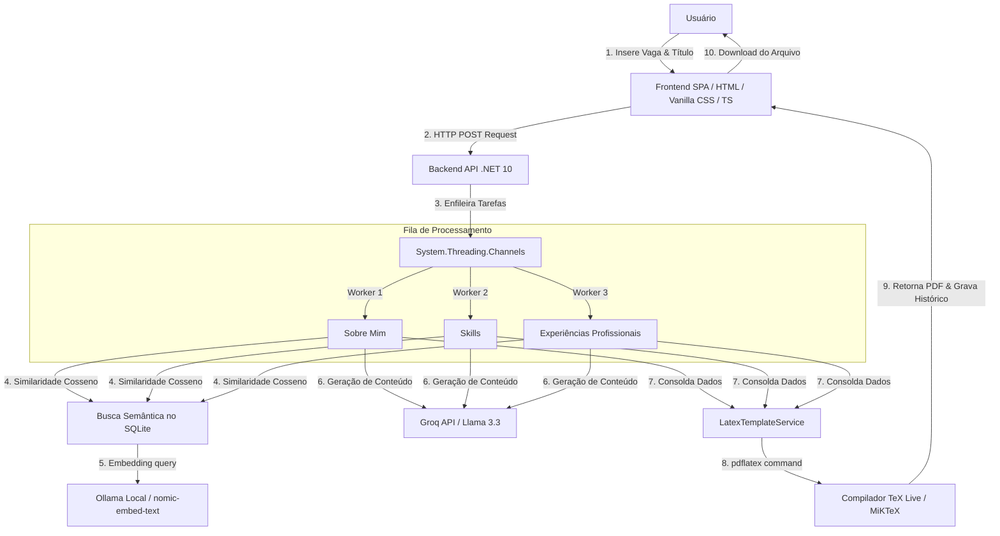
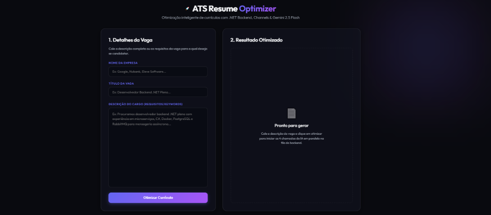

# 🚀 ATS Resume Optimizer

> **Generate ATS-optimized resumes in ~25 seconds using local AI, parallel processing and automatic PDF generation — completely free and privacy-first.**

[](https://dotnet.microsoft.com/)
[](https://ollama.com/)
[](https://groq.com/)
[](https://www.docker.com/)
[](https://www.latex-project.org/)
[](https://sqlite.org/)
[](LICENSE)

---

## 🎯 Proposta do Projeto

O **ATS Resume Optimizer** é um sistema open-source de alta performance projetado para resolver o gap de compatibilidade entre perfis de candidatos e vagas de emprego. Ele elimina o processo manual e repetitivo de reescrever o currículo para cada candidatura, adaptando as experiências e habilidades do profissional de forma dinâmica usando Inteligência Artificial e busca semântica (RAG).

### 🔄 Fluxo de Valor Simplificado

```
  [ Upload do Currículo ] ➔ [ Upload da Vaga ] ➔ [ Análise Semântica (IA) ]
                                                            │
  [ Download Imediato ]   ◀─── [ PDF Final ATS ] ◀─── [ Atualização LaTeX ]
```

1. **Upload do Currículo Base**: O sistema consome seus dados profissionais cadastrados.
2. **Upload da Descrição da Vaga**: Você cola os requisitos e cargo pretendido.
3. **Análise por IA**: Keywords ATS são extraídas e cruzadas com a sua bagagem.
4. **Atualização Automática**: Resumos e conquistas são reescritos sob medida.
5. **Geração de PDF**: Compilação LaTeX cria um documento esteticamente impecável.
6. **Download Imediato**: Seu currículo pronto para submissão em segundos.

---

## ⚡ Why CV Automation? (Diferenciais)

* **✅ 100% Gratuito & Open Source**: Sem assinaturas mensais, sem limites de geração e sem pegadinhas.
* **✅ Privacidade Absoluta (Local-First)**: Com a integração com o Ollama, seus dados e currículos **não saem da sua máquina**.
* **✅ Sem Dependência de APIs Pagas**: Pode ser operado localmente sem chaves de API pagas.
* **✅ Aceleração via Groq**: Suporte a APIs de baixíssima latência (Groq) para aceleração de texto.
* **✅ Processamento Concorrente**: Execução simultânea de múltiplos módulos de inteligência artificial.
* **✅ Geração de PDF Diagramado**: Não gera PDFs genéricos ou feios. Ele gera documentos profissionais diagramados via **LaTeX** (padrão utilizado no meio acadêmico e por engenheiros de software seniores).

---

## 📊 Performance & Escalabilidade

O backend do sistema foi projetado para alta concorrência e throughput. Ele implementa uma fila de produtores-consumidores assíncrona baseada em `System.Threading.Channels` e executa múltiplos workers paralelos.

* **Concorrência Otimizada**: Ao invés de fazer as chamadas de IA de forma sequencial (o que levaria mais de 1 minuto), o backend faz as chamadas em paralelo para preencher o currículo em tempo recorde.
* **Redução de Latência**: Utiliza modelos leves e otimizados para extração e geração rápida.

| Métrica | Valor |
| :--- | :--- |
| **Workers Paralelos** | 3 (Concorrentes no Bounded Channel) |
| **Execução de Tarefas** | Assíncrona e Não-Bloqueante |
| **Tempo Médio de Geração** | **~25 segundos** (Ollama Local) / **~5 segundos** (Groq) |
| **Saída do Documento** | PDF Formatado e pronto para leitura de robôs ATS |

---

## 🏗️ Arquitetura do Sistema

O sistema é construído sobre pilares de desenvolvimento modernos:



* **Frontend**: Single Page Application escrita em vanilla HTML, CSS e TypeScript com visual escuro premium e micro-animações.
* **Backend**: ASP.NET Core 10 Web API estruturado com suporte a injeção de dependência e controle de concorrência resiliente via Polly.
* **RAG Semântico**: SQLite mapeia os blocos de dados. Um algoritmo de similaridade de cosseno (SIMD) compara os vetores gerados por modelos de Embeddings locais.
* **LaTeX Compiler**: O serviço encapsula a invocação do `pdflatex` de forma isolada em pastas temporárias exclusivas, garantindo isolamento de I/O de arquivos.

---

## 🖼️ Screenshots

### Interface



### Resultado

*Adicione aqui os screenshots do PDF gerado pelo sistema.*
```
[ Placeholder: screenshot_cv_gerado.png ]
```

---

## 🗺️ Roadmap de Evolução

- [x] Geração automática de currículo adaptada a vagas
- [x] Exportação de arquivos LaTeX e compilação para PDF
- [x] Busca Semântica RAG integrada a banco vetorial (SQLite + Embeddings)
- [x] Processamento em lote paralelo com Channels C#
- [x] Integração flexível com Ollama local
- [ ] Multi-idioma nativo (Português, Inglês, Espanhol)
- [ ] Múltiplos templates estéticos de LaTeX selecionáveis pelo usuário
- [ ] Histórico e versionamento de currículos com comparativo de versões
- [ ] Módulo de análise e pontuação ATS (simulando sistemas reais de vagas)
- [ ] Integração de importação direta de dados do LinkedIn

---

## ⚡ Quick Start

### 1. Clonar o Repositório
```bash
git clone https://github.com/joselucas0/cv_automation.git
cd cv_automation
```

### 2. Configurar as Chaves no `.env`
Crie um arquivo `.env` na raiz do projeto com as suas credenciais locais e de nuvem (veja [.env.example](.env.example) se disponível):
```text
GROQ_API_KEY=sua_chave_groq_aqui
GROQ_BASE_URL=https://api.groq.com/openai/v1
GROQ_MODEL=llama-3.3-70b-versatile

EMBEDDING_BASE_URL=http://localhost:11434/v1
EMBEDDING_MODEL=nomic-embed-text
```

### 3. Executar com Docker Compose
Suba toda a aplicação (API backend com pdflatex nativo + Nginx frontend) com um único comando:
```bash
docker-compose up -d
```
*O Backend subirá na porta `5005` e o Frontend estará disponível em `http://localhost:8000`.*

### 4. Instalar o modelo de embeddings no Ollama
Certifique-se de que o Ollama está rodando e baixe o modelo de busca semântica localmente:
```bash
ollama pull nomic-embed-text
```

### 5. Semear a Base Inicial
Gere os vetores das suas experiências no banco SQLite rodando o script:
```bash
python scripts/seed_database.py
```

Pronto! Acesse `http://localhost:8000` no seu navegador e comece a otimizar seus currículos de forma rápida, gratuita e segura.
